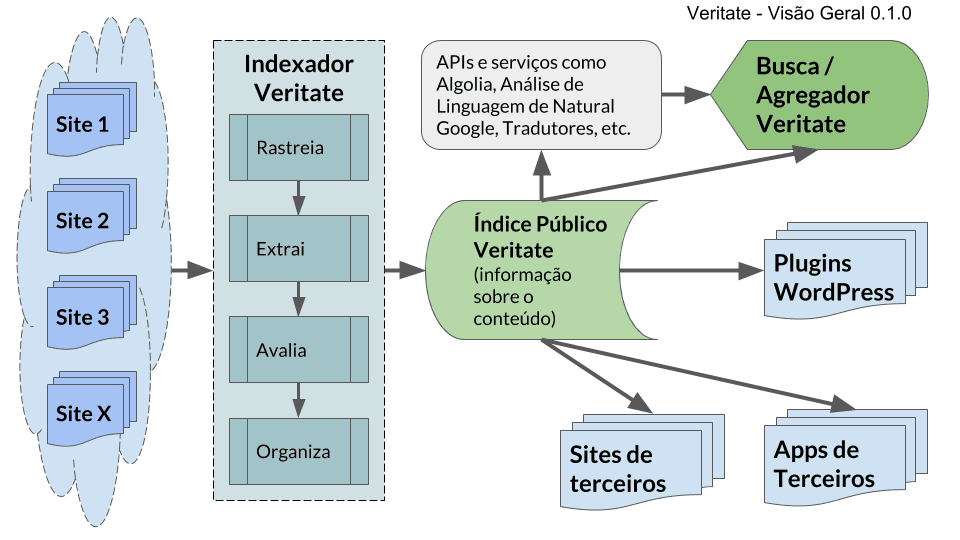

# Veritate - Agregador e Buscador de Checagem de Fatos

Veritate é um **projeto experimental sem fins lucrativos** de agregador/buscador reunindo artigos diversas agências de **checagem de fatos**.

> **For english version, [click here](README-EN.md).**

A Prova de Conceito tem lançamento previsto para 7 de Maio de 2018.

> Para mais informações, para solicitar a inclusão de um site de checagem ou solicitar exclusão de material que viole direitos autorais, entre em contato através do email veritate{arroba}wowperations[ponto]com[ponto]br

## Sobre a iniciativa

Idealizado pelo desenvolvedor <a href="https://www.celsobessa.com.br">Celso Bessa</a>, com suporte em hospedagem e infra-estrutura: <a href="https://www.wowperations.com.br">WoWPerations</a>, a iniciativa  Veritate tem como objetivos:

- Incentivar o consumo de jornalismo de qualidade   
- Estimular o compartilhamento de checagens de fatos 
- Instigar o senso crítico a respeito de notícias falsas (_Fake News_)
- Fornecer uma ferramenta que ajude as pessoas a tomar decisões baseadas em informações verídicas
- Investigar, estudar e experimentar tecnologias, algoritmo, padrões de design, experiência de uso em buscas, e jornalismo intermediado por algoritmo

Inicialmente, a iniciativa terá os seguintes componentes: Indexador, Índice Público/API, e Agregador.

### Visão Geral - Veritate

### Indexador

Uma ferramenta para indexação, avaliação e organização de artigos publicados em veículos de checagem de fatos.

No momento, estamos utilizando um serviço de terceiro (Saas) para rastreio (crawl) e raspagem de dados (scrapping) e um sistema próprio para avaliação e organização. É possível que num futuro próximo utilizemos infra-estrutura própria para rastreio/raspagem. Eventualmente, tornaremos público o sistema de avaliação.

### Índice Público (API)

Um índice público com informações sobre as checagens de fatos indexadas para consumo por sistemas, que poderão consultá-lo através de uma API REST, com informações apresentadas em JSON.

É a partir de sua API que alimentaremos o agregador e possibilitaremos a criação de serviços e sistemas por terceiros. Por exemplo, um plugin de WordPress poderia apresentar links de checagem de fatos para palavras-chave usadas no post de um blog.

### Agregador

Uma ferramenta de busca onde que as pessoas irão encontrar links para artigos dos principais sites de checagem de fatos do Brasil. Por exemplo, uma pessoa que procurar a expressão "Lava Jato" verá uma série de links para checagens de fatos sobre a Operação Lava Jato nos sites indexados, e ao clicar nos links, lerá o conteúdo diretamente no site original.

## Perguntas Frequentes (FAQ - Frequently Asked Questions)

### Quais os veículos que são indexados por esta iniciativa?

Neste momento, apenas [Agência Lupa](http://piaui.folha.uol.com.br/lupa/), [Agência Pública](https://apublica.org/checagem/) and [Aos Fatos](https://aosfatos.org).

### Como posso sugerir um veículo ou ter meu veículo adicionado?

Envie um email para o endereço mencionado acima. Nós vamos indexar apenas sites respeitados ou com bom jornalismo, de acordo com nosso conselho editorial. Temos o plano de criar um guia editorial, mas ainda não sabemos quando ele será publicado.

No aspecto tecnológico, nós priorizamos sites usando WordPress e que usem o markup LD+JSON para checagem de fatos. Nosso rastreador e nosso algoritmo privilegia sites rápidos, acessíveis e seguros (usando HTTPS), especialmente os acessíveis facilmente por celulares ou leitores de tela. E se você der permissão expressa podemos apresentar pequenos trechos (entre 140 e 280 caracteres) do artigo de seu site, para que o conteúdo seja rastreado mais rapidamente e tenha prioridade entre os resultados.

Como regra geral, *se for jornalismo bem feito, tiver boa nota no Google Page Speed Insights e passar no teste da WCAG2.0*, está bom para nós.

### Esta iniciativa tira tráfego dos sites de checagem?

Não! Ao contrário: o objetivo é gerar MAIS tráfego e melhorar ao alcance destes sites.

### Esta iniciativa atrapalha o SEO deste sites?

Não. Como é uma API, apenas deixa os dados acessíveis, mas não conta como conteúdo para buscadores.

### Esta iniciativa tem um objetivo comercial?

Não, é um experimento sem fins lucrativos. Caso se torne algo maior, provavelmente será como fundação, ONG ou algo assim, sem fins lucrativos, transparente e com a missão de fortalecer o "ecossistema" de checagem de fatos.

## Histórico de versões / Changelog

O arquivo [CHANGELOG.md](CHANGELOG.md) contém o histórico de versões da iniciativa de uma perspectiva global e alterações deste repositório. Cada componente (e seus possíveis sub-componentes) terão históricos (Changelogs) específicos e mais detalhados

## Como ajudar o projeto

Com código, redação de textos e ajuda e wiki, etc. Mais informações em breve.
